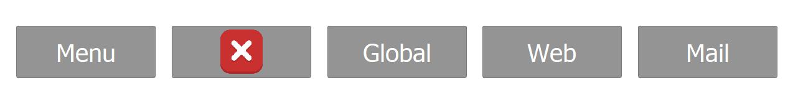
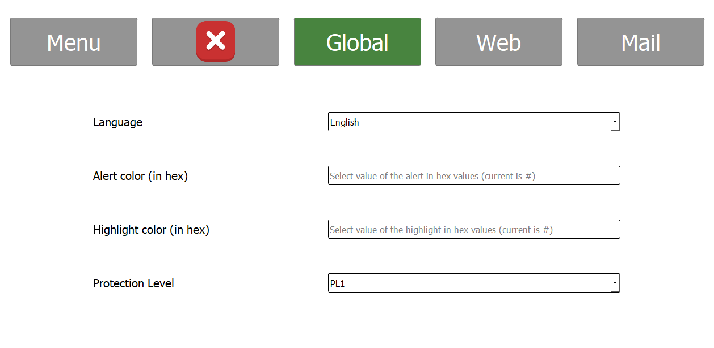
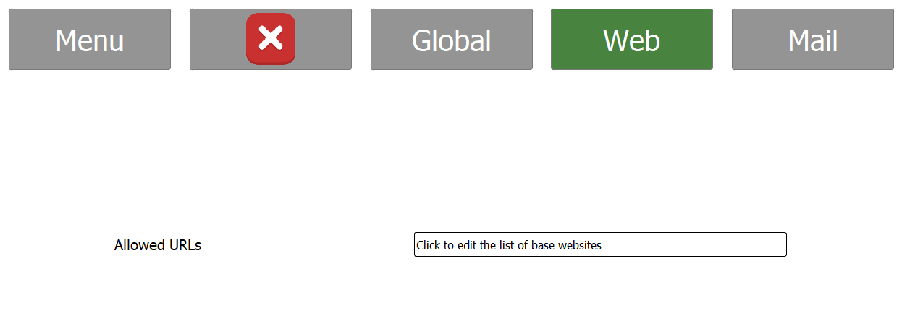
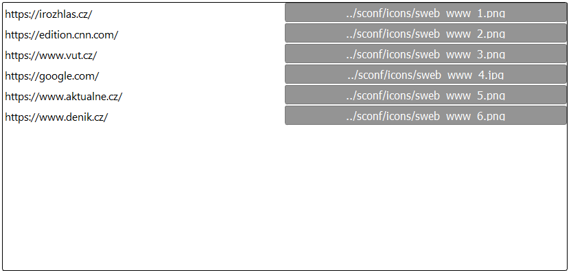
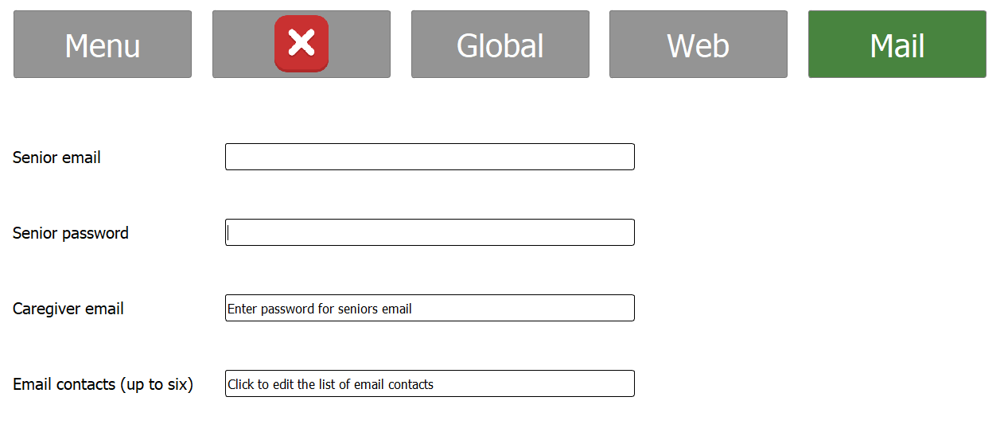
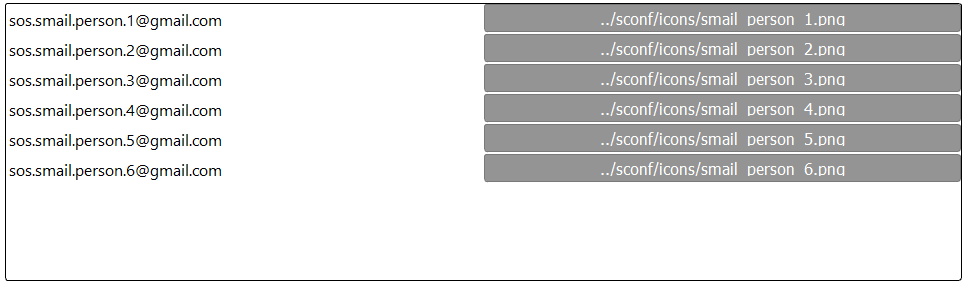

# 
User Guide for SCONF Application

## Application control
The main control area of the SCONF application is a menu bar composed of 5 buttons.

Buttons from left to right:
1. Menu - in current implementation this button does not provide any functionality
2. Exit button - terminates the SCONF application
3. Global - provides controls and configuration options for global settings which affect all the applications
4. Web - provides specific controls and configuration options for the SWEB application
5. Mail - provides specific controls and configuration options for the SWEB application
## Global configuration

Global screen provides following configuration options from top to bottom:
1. Language - sets the langauge of the entire Senior Operating System, by the default the language is set to English
2. Alert color - sets color which is displayed to the user when under an attack. Be it phishing, spam or any other form
3. Highlight color - sets color which is displayed when user interacts with one of the elements in the user interface
4. Protection level - sets the level of protection which Senior OS provides for the user. By changing the protection level 
some of the other attributes of the OS are set. [More information can be found on the front page os this repository](https://github.com/forsenior/senior-os)
## SWEB configuration

*Please note that other attributes of the SWEB application are controlled by the Protection level set in the global configuration.*

SWEB screen provides following configuration options:
1. Allowed URLs - sets whitelist of URLs which the senior is capable of reaching. This setting is done through clicking 
the appropriate text box. This action will then open the following dialog which allows the caregiver to input pairs of websites (URLs) and their icons

## SMAIL configuration

*Please note that other attributes of the SWEB application are controlled by the Protection level set in the global configuration.*

SMAIL screen provides following configuration options from top to bottom:
1. Senior email - sets the email address of the senior which will be used by the SMAIL client
2. Senior password - sets the password for the seniors email account
3. Caregiver email - sets the email address of the caregiver which is then used by the SMAIL and SWEB to 
inform the caregiver about malicious attacks attempted on the senior either through the MAIL or WEB
4. Email contacts - sets whitelist of email contacts which the senior is allowed to contact through the SMAIL client. This is done through clicking
the appropriate text box. This action will then open the following dialog which allows the caregiver to input pairs of emails and profile pictures
