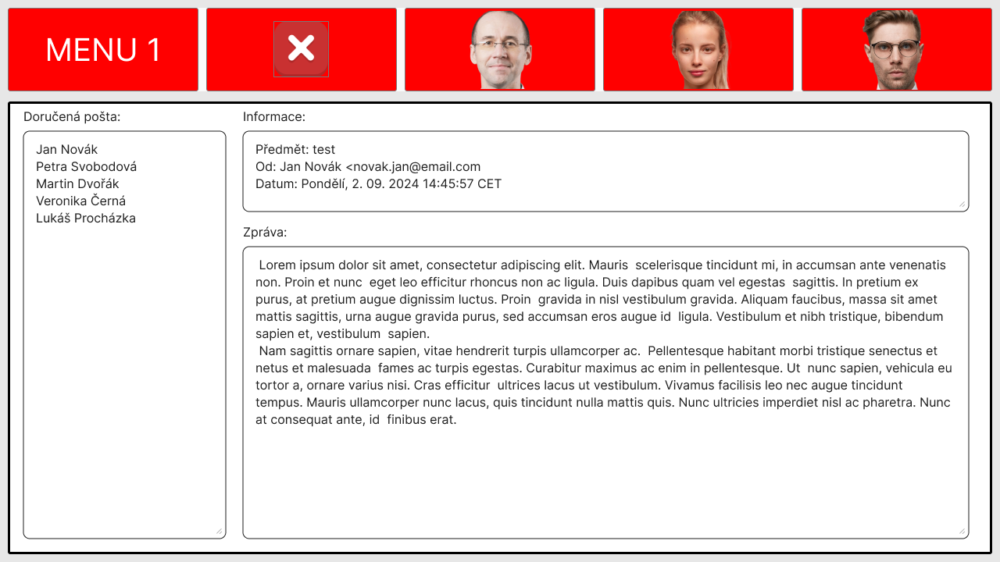

<h1> Design documentation of GUI for Senior-OS </h1>

Figma design: https://www.figma.com/design/0CZVc5aoEZIcFHPEb2neeS/SOS?node-id=14-241&t=hJqRy5vxri6a8EMR-1

<h2>Terminology</h2>

<h3>Key words</h3>

| Term | Explenation |
| ---- | ----------- |
| Normal State | State of the application during the regular run, for example no phishing attempt was detected |
| Phishing State | State of the application during the visit to a fordulant site which may attempt to perform phishing attack |
| Main application area | Area of the application displaying content for the user |
| SMAIL default view | Default view of the SMAIL application which is shown to the user |

<h3>Abbreviations</h3>

| abbreviation | Full definition |
| ------------ | --------------- |
| SOS | Senior Operating System |
| SWEB | Web browser for the senior |
| SMAIL | E-Mail client for the senior |
| SCONF | Control application for the caregiver |

<h2> Global design guide </h2>
Each application, be it SWEB, SCONF or SMAIL will consist of two distinct areas, first one being Menu bar, and the second main area of the application.

*Pleas note that the design guideline is based for the standard resolution of 1280x720p. Special case of scaling will be described further down in the document fro each part of the application.*

<h3>Menu bar</h3>
This area will be made up of five buttons with uniform size, color, and detailing. This guideline must be applied to SCONF, SWEB, and SMAIL, any application specific guidelines are defined in separate sections. Therefore following shall be adheard to:</br>

<br>

</br>

<h4>Menu bar</h4>
 
 * Margin:                  None, bar to hug the contents

<h4>Menu text settings</h4>

* Font family:              Inter (google font)
* Font size:                40px
* Font:                     Regular
* Font color:               FFFFFF (hex)
* Position:                 Center, Center

<h4>Bar background (Normal State)</h4>
 
 * Bar fill:                Transparent
 * Border fill              Transparent 
 * Border thickness         0px

<h4>Buttons (Normal State)</h4>

 * Button size (Minimal):             244x107 (WxH)
 * Button corner radius:    3px
 * Button border thickness: 1px
 * Button fill:             949494 (hex)
 * Border color:            797979 (hex)
 * Icon/Text position:      Center/Center
 * Button margin:           10px, 10px, 10px, 12px (Left, Top, Right, Bottom)

<h4>Bar bacground (Phishing State)</h4>

 * Bar fill:                FF0000 (hex)
 * Border fill:             F90000 (hex)
 * Border thickness:        1px

<h4>Buttons (Phishing State)</h4>

 * Button size (Minimal):             244x107 (WxH)
 * Button corner radius:    3px
 * Button border thickness: 1px
 * Button fill:             F90000 (hex)
 * Border color:            797979 (hex)
 * Icon/Text position:      Center, Center
 * Button margin:           10px, 10px, 10px, 12px (Left, Top, Right, Bottom)

<h4>Scaling</h4>
The scaling behavior of the Menu bar is following. The bar and buttons must ramain at the top of the screen with consistant marging of ```10px, 10px, 10px, 12px (Left, Top, Right, Bottom)```. The button size (Width and Height) must stay the same and center, only thing scaling will be the MenuBar Background container which will create uniform gray line accross the screen.

<h3>Main application area</h3>


This area of the application must be uniform accross all of the applications of the SOS, with exception being SCONF and the starting menue of the SOS. Those two cases will have their own special sections defining their design guidelines.

*Please note that this design specification only for the size and styling of the main application window, SMAIL will have its own granular specification for the user interface components (text fields, lists, etc...)*

 * Backgoud:                FFFFFF (hex)
 * Window size:             1260x580 (WxH)
 * Border corner radius:    3px
 * Border thickness:        3px
 * Border color:            000000 (hex)
 * Margin:                  10px, *defined by Menu*, 10px, 10px (Left, Right, Bottom) 

<h4>Scaling</h4>
Main application shall not scale with the display/system and should ramin at its fixed size of 1260x580, and centered.

<h2>SMAIL</h2>
The Menu bar and the Main application window must adhear to the previously stated global desin guideline. Rest of the UI will be described in the sections below.

<h3>SMAIL global guidelines (applicable to all states of smail)</h3>

Menu bar and Main application window to adhear to the global guideline written above.

<h4>Text </h3>
 
 * Font family:             Inter (google font)
 * Font size:               16px
 * Font:                    Regular
 * Font color:              00000 (hex)
 * Position:                Allignet to the left

<h4>Label</h4>

 * Size: 22px Height (or specified by usage)
 * Fill: Transparent
 * Margin: to be specified by each usage
 * Border thickness: 0px
 * Border color: Transparent
 * Border corner radius: 0px

<h4>Scaling</h4>
Global guideline for scaling Menu bar aplies in this instance, only change in this instance is that the container containing the message scales with the size of the screen, while rest of the control fields remain the same.

<h3>SMAIL default view - writing email</h3>

Default view of the SMAIL shall present the user with the interface described and shown bellow.


<h4> Received email </h4>
Received email area is composed of two components, label and list

 * Label:
    - Margin: 15px, 10px, 10px (Left, Top, Bottom)
 * List:
    - Size: 259x522 (WxH)
    - Fill: Transparent
    - Border thickness: 1px
    - Border color: 00000 (hex)
    - Border corner radius: 8px
    - Text margin: 5px (Top and Bottom)
    - Text allignment: Left

<h4> Email inputs </h4>
Email input area consists of two labels, for receiver and subject of the email, and two input fields. Those coponents are going to be onsidered one block with shared specifications.

 * Label:
    - Margin: 10px, 10px (Top, Bottom)
 * Input field:
    - Size: 580x40 (WxH)
    - Fill: Transparent
    - Border thickness: 1px
    - Border corner radius: 8px
    - Border color: 00000 (hex)
    - Text margin (inside the field): 10px
    - Text allignment (inside the field): Left
    - Other text values applicable from global settings

<h4>Message writer</h4>
Message writer area is composed of two components, label and text block

*Both entities should have 20px margin on Left, Right, and bottom*

 * Label:
    - Size: 22px Height
 * List:
    - Size: 929x374 (WxH)
    - Fill: Transparent
    - Border thickness: 1px
    - Border color: 00000 (hex)
    - Border corner radius: 8px
    - Text margin: 5px (Top and Bottom)
    - Text allignment: Left

<h3>SMAIL reading message</h3>
View of the SMAIl when reading received email.


<h4> Received email </h4>
Received email area is composed of two components, label and list

 * Label:
    - Margin: 15px, 5px, 5px (Left, Top, Bottom)
 * List:
    - Size: 259x522 (WxH)
    - Fill: Transparent
    - Border thickness: 1px
    - Border color: 00000 (hex)
    - Border corner radius: 8px
    - Text margin: 5px (Top and Bottom)
    - Text allignment: Left

<h4> Message information </h4>
Message information area of the application is composed of two components, label and text block containing information about sender and the email it self.

 * Label
    - Margin: 15px, 5px, 5px (Left, Top, Bottom)
 * Text Block
    - Size: 929x103 (WxH)
    - Fill: Transparent
    - Border thickness: 1px
    - Border color: 00000 (hex)
    - Border corner radius: 8px
    - Text margin: 5px (Top and Bottom)
    - Text allignment: Left

<h4> Message viewer </h4>
Message viewer area of the application is composed of two components, label and text block containing the email it self.

* Label
    - Margin: 15px, 5px, 5px (Left, Top, Bottom)
 * Text Block
    - Size: 929x404 (WxH)
    - Fill: Transparent
    - Border thickness: 1px
    - Border color: 00000 (hex)
    - Border corner radius: 8px
    - Text margin: 10px, 5px (Left and Right ,Top and Bottom)
    - Text allignment: Left

<h3>SMAIL phishing state </h3>



<h2>SWEB</h2>


<h3>SWEB phishing state</h3>


<h3>SWEB Menu 2</h3>


<h3>SWEB search bar</h3>


<h2>SCONF</h2>
The Menu bar and the Main application window must adhear to the previously stated global desin guideline. Rest of the UI will be described in the sections below.

<h3>SCONF global guidelines (applicable to all states of smail)</h3>

Menu bar and Main application window to adhear to the global guideline written above.

<h4>Text </h3>
 
 * Font family:             Inter (google font)
 * Font size:               16px
 * Font:                    Regular
 * Font color:              00000 (hex)
 * Position:                Allignet to the left


