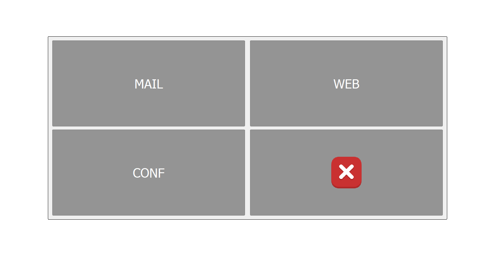
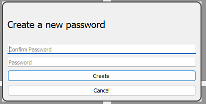
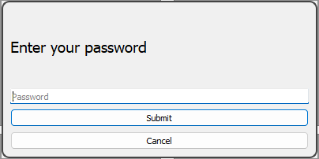

# 
User Guide for SRUN Application

## Abbreviations
| abbreviation | Full definition | Documentation                                |
|------------| --------------- |----------------------------------------------|
| SOS        | Senior Operating System | -                                            |
| WEB        | Web browser for the senior | [SWEB](../../sweb/docs/sweb_manual_en.md)    |
| MAIL       | E-Mail client for the senior | [SMAIL](../../smail/docs/smail_manual_en.md) |
| CONF       | Control application for the caregiver | [SCONF](../../sconf/docs/sconf_manual_en.md) |
## Application Control:
The main window of the SRUN consist of four buttons.

Buttons from top left are:
1. MAIL - opens the application [SMAIL](../../smail/docs/smail_manual_en.md)
2. WEB - opens the application [SWEB](../../sweb/docs/sweb_manual_en.md)
3. CONF - opens the application [SCONF](../../sconf/docs/sconf_manual_en.md), and brings up the dialog prompting the user to create or enter the password depending on whether the OS/SRUN are starting for the first time
4. EXIT - terminates all the applications that could possibly run in the background of the SOS, and terminates the SOS itself
## First startup and configuration of the environment
During the initial start up of the operating system and configuration the user will be prompted to complete certain operations,
among them the setup of the password for the application which allows the caregiver to configure the behavior of other applications.
### Password setup for initial startup
1. Open the CONF application
2. Wait for the password creation dialog to open
3. In this dialog create the password which will be used to authenticate the user when he tries to open the CONF application
4. Upon pressing create the password is securely stored and the CONF application is opened

### Password usage during regular use
1. Open the CONF application
2. Wait for dialog prompting for password
3. Enter the password into the dialog and press submit button after which the CONF application will open
