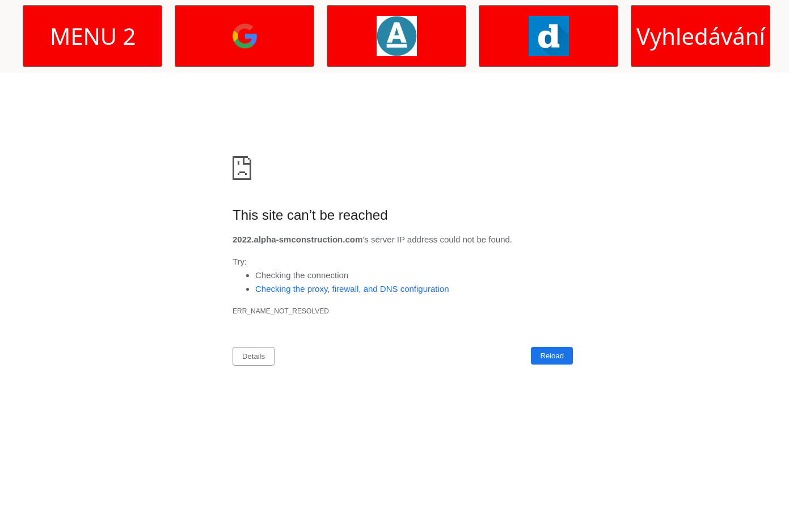

# 📖 Choose your language / Wählen Sie Ihre Sprache / Zvolte si jazyk

- [English](README.md)
- [Deutsch](README.de.md)
- [Čeština](README.cz.md)

# Webbrowser für Senioren und geistig behinderte Menschen

## Überblick über die Anwendung

Dieses Projekt ist ein speziell für Senioren entwickelter Webbrowser, der mit PyQt5 erstellt wurde und besonderen Wert auf Barrierefreiheit, Einfachheit und Sicherheit legt.
Das Ziel ist es, eine benutzerfreundliche Umgebung für ältere Menschen zu schaffen, indem Funktionen wie verbesserte Lesbarkeit von Texten, intuitive Navigation,
Audio-Unterstützung, mehrsprachige Optionen und robuste Sicherheitsmaßnahmen gegen Phishing-Websites bereitgestellt werden.
Nachfolgend finden Sie das Designkonzept des Webbrowsers:

## Überblick MENU1
MENU1 bietet eine benutzerfreundliche Oberfläche mit fünf  großen, festen Schaltflächen, die speziell für eine einfache Navigation konzipiert wurden.


Funktionen der Schaltflächen:

1. MENU1-Schaltfläche: Wechselt die Menüleiste zu MENU2.
2. Beenden-Schaltfläche: Schließt die Anwendung.
3. Webseiten-Schaltflächen (3): Öffnen vordefinierte Websites.
   
## Überblick MENU2
MENU2 enthält fünf Schaltflächen mit folgenden Funktionen:


Funktionen der Schaltflächen:

1. MENU2-Schaltfläche: Wechselt die Menüleiste zurück zu MENU1.
2. Webseiten-Schaltflächen (3): Öffnen vordefinierte Websites.
3. Such-Schaltfläche: Öffnet eine Suchleiste für Benutzeranfragen.

## Erkennung von Phishing-Websites
Diese Funktion ist das Herzstück unserer Anwendung und warnt Benutzer, wenn eine Website möglicherweise eine Phishing-Seite ist.



- Phishing-Warnung: Wenn der Benutzer eine bekannte Phishing-URL eingibt, ändert sich der Hintergrund der Symbolleiste auf Rot, um eine einfache Erkennbarkeit zu gewährleisten, insbesondere für Senioren.
- Nachfolgend ist ein Diagramm dargestellt, das den Prozess zur Erkennung von Phishing-URLs zeigt.
<p align="center">
  
</p>
Weitere Details zur Funktionsweise des Phishing-Detektors finden Sie in der Dokumentation.

## Installation

### Starten der Anwendung  

Um die Anwendung zu starten, gehen Sie wie folgt vor:  

1. Laden Sie die neueste ISO aus dem Repository [hier](https://github.com/forsenior/senior-os/releases) herunter.  
2. Erstellen Sie eine neue virtuelle Maschine in Ihrer bevorzugten Virtualisierungssoftware (z. B. VirtualBox, VMware oder QEMU).  
3. Hängen Sie die heruntergeladene ISO an die virtuelle Maschine an oder erstellen Sie einen bootfähigen USB-Stick. Die ISO basiert auf einer Linux-Distribution (Archie).  
4. Starten Sie die virtuelle Maschine. Falls die Anwendung nicht automatisch startet, öffnen Sie das Terminal und führen Sie folgenden Befehl aus:  

   ```sh
   srun
   ```  

---

### Installation und Entwicklungsumgebung  

Für einfachere Modifikationen und eine bessere Übersicht der Anwendung folgen Sie diesen Schritten:  

#### Schritt 1: Installation von Poetry  

SWEB verwendet [Poetry](https://python-poetry.org/) für das Abhängigkeitsmanagement und die Paketierung. Falls Sie Poetry noch nicht installiert haben, folgen Sie der offiziellen [Installationsanleitung](https://python-poetry.org/docs/#installation).  

#### Schritt 2: Repository klonen und Abhängigkeiten installieren  

Sobald Poetry installiert ist, fahren Sie wie folgt fort:  

```sh
# Projekt-Repository klonen
git clone https://github.com/forsenior/senior-os  

# In das Projektverzeichnis wechseln
cd sweb  

# Abhängigkeiten installieren
poetry build  
poetry install  
```  

Wiederholen Sie diese Schritte für die Verzeichnisse `sconf` und `srun`:  

```sh
cd ..  
cd sconf  
poetry build  
poetry install  

cd ..  
cd srun  
poetry build  
poetry install  
```  

#### Starten der Anwendung  

Um SWEB zu starten, verwenden Sie:  

```sh
poetry run sweb  
```  

**Unterstützte Python-Versionen:**  
Dieses Programm wurde für **Python 3.12** getestet und optimiert.  
> [!NOTE]  
> Falls Sie versuchen, die SWEB-Anwendung eigenständig auszuführen, können Fehler aufgrund des Konfigurationsdateipfads auftreten. Standardmäßig sollte sich die Datei config.json hier befinden:  
> "$HOME/$USER/.sconf/config.json"

## Demonstrationsvideo

https://github.com/user-attachments/assets/88fbb138-6467-47d3-ad12-a0fb98515719

# So können Sie beitragen
Fühlen Sie sich frei, Pull Requests einzureichen oder Probleme zu melden, falls Sie Fehler finden oder Verbesserungsvorschläge haben.

## Lizenz
Dieses Projekt ist unter der MIT-Lizenz lizenziert.

